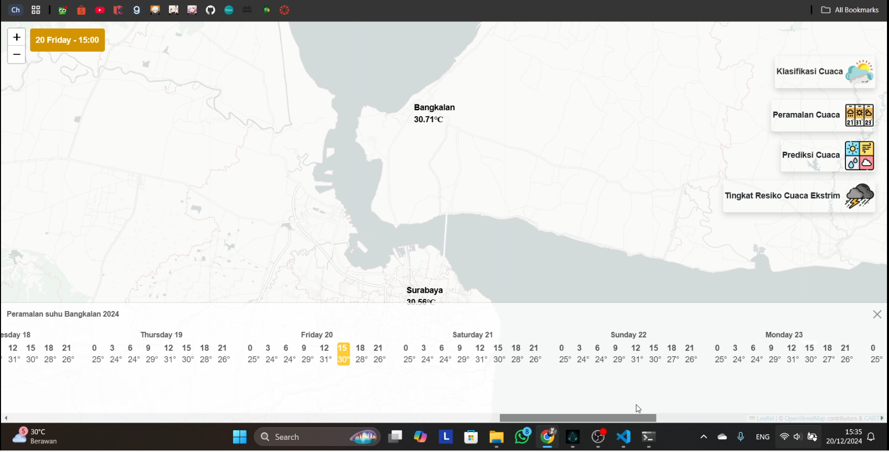
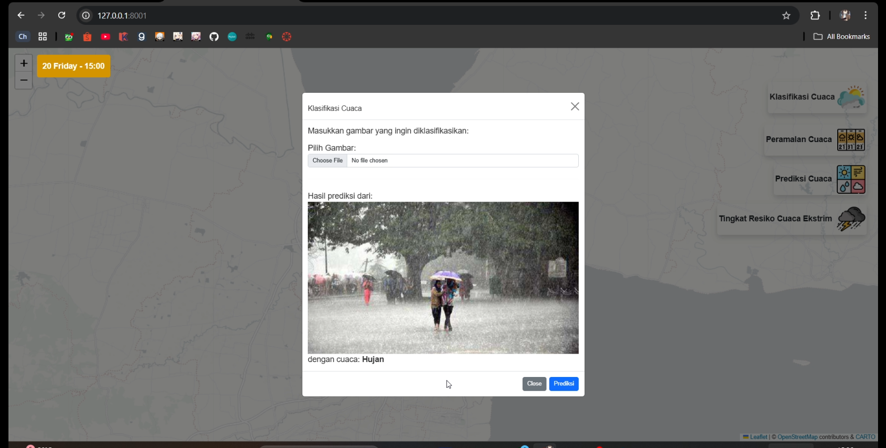
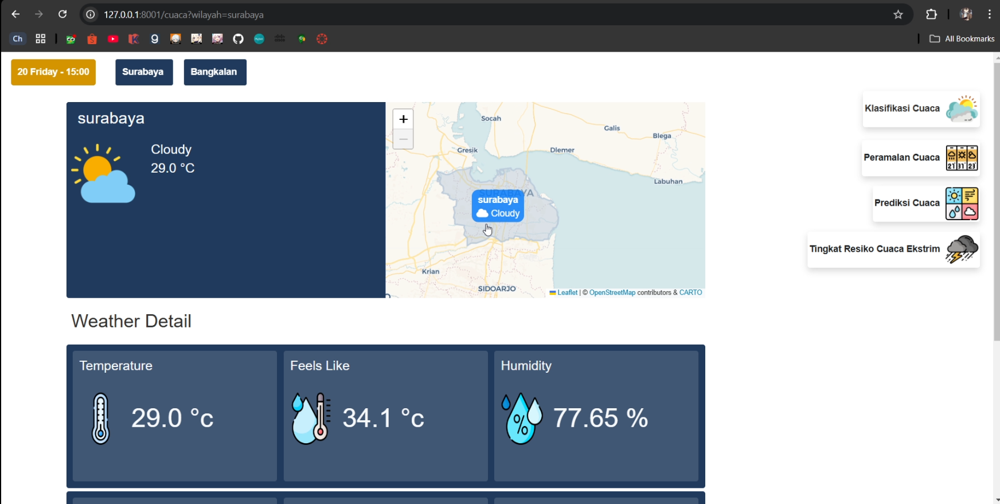
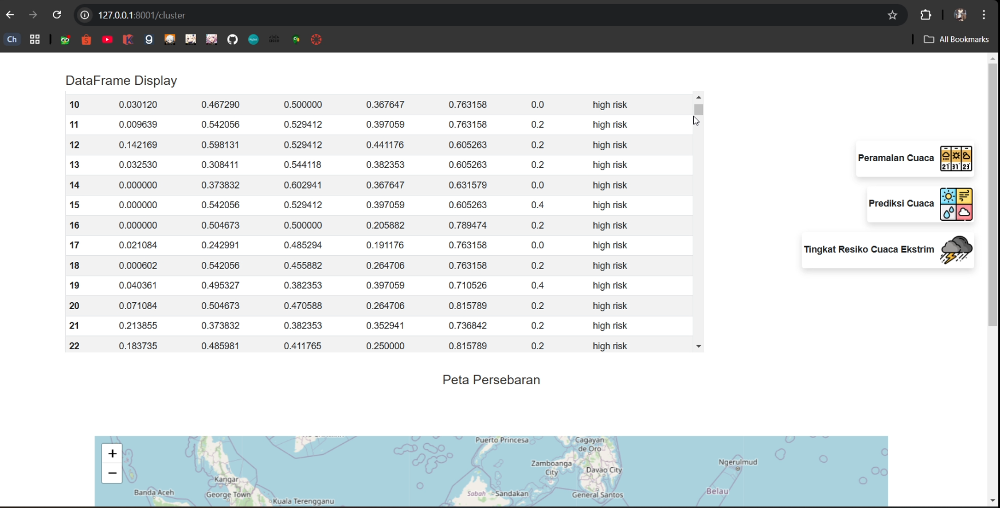

# **Weather Prediction and Classification**

## **Deskripsi Proyek**

Proyek ini adalah implementasi ilmu big data untuk memproses dan menganalisis data cuaca. Sistem ini mencakup berbagai fitur seperti klasifikasi gambar cuaca, prediksi cuaca, dan pengelompokan data untuk memberikan informasi yang lebih akurat kepada pengguna.

## **Fitur Utama**

1.  **Tampilan Awal**:
    
    -   Menampilkan peta interaktif dengan dua lokasi kota yakni Surabaya dan Bangkalan.
    -   Menyediakan menu untuk mengakses fitur utama: klasifikasi, peramalan, prediksi, dan tingkat risiko cuaca ekstrem.
2.  **Klasifikasi Gambar Cuaca**:
    
    -   Mengklasifikasikan gambar cuaca berdasarkan kondisi seperti cerah, berawan, atau hujan menggunakan model pembelajaran mesin.
3.  **Prediksi Cuaca**:
    
    -   Menyediakan prediksi cuaca untuk wilayah tertentu.
    -   Detail meliputi suhu, kelembapan, dan indeks panas.
4.  **Clustering Data Cuaca**:
    
    -   Pengelompokan data historis cuaca untuk mengidentifikasi pola cuaca.

## **Teknologi yang Digunakan**

-   **Backend**: Flask
-   **Frontend**: Leaflet.js untuk peta interaktif, HTML, CSS, dan JavaScript.
-   **Machine Learning**:
    -   Model Klasifikasi: CNN dan Random Forest
    -   Model Prediksi: SARIMA
    -   Model Klastering: K-Means


## **Cara Instalasi dan Penggunaan**

1.  **Clone Repository**:
    
    ```bash
    git https://github.com/rrayhka/weather-app.git
    cd weather-app
    
    ```
2.  **Buat Virtual Environment**:
    
    ```bash
    python -m venv env
    source env/bin/activate  # Untuk Linux/MacOS
    env\Scripts\activate     # Untuk Windows
    
    ```
        
3.  **Instalasi Dependensi**:
    
    ```bash
    pip install -r requirements.txt
    
    ```
    
4.  **Menjalankan Aplikasi**:
    
    ```bash
    python main.py
    
    ```
    
5.  **Akses Aplikasi**: Buka browser dan akses `http://127.0.0.1:8001`.
    

## **Contoh Tampilan**

### Peramalan Cuaca



### Klasifikasi Gambar Cuaca



### Prediksi Cuaca



### Pemetaan Tingkat Resio Cuaca


### 

## **Kontributor**

Big Thanks to 

[@Ranwiesiel](https://github.com/Ranwiesiel) : Prediction with Sarima

[@Rieko00](https://github.com/Rieko00) : Klasifikasi Random Forest

[@wchynto](https://github.com/) : Klustering K-Means

[@rrayhka](https://github.com/rrayhka) : Klasifikasi CNN
